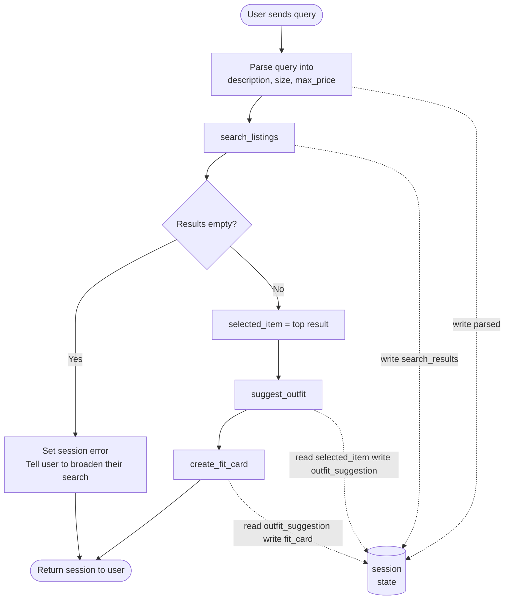

# FitFindr — planning.md

> Complete this document before writing any implementation code.
> Your spec and agent diagram are what you'll use to direct AI tools (Claude, Copilot, etc.) to generate your implementation — the more specific they are, the more useful the generated code will be.
> Your planning.md will be reviewed as part of your submission.
> Update it before starting any stretch features.

---

## Tools

List every tool your agent will use. For each tool, fill in all four fields.
You must have at least 3 tools. The three required tools are listed — add any additional tools below them.

### Tool 1: search_listings

**What it does:**
Searches the object array's in the JSON file based on the users input and finds relevant items and returns the matching items to the agent

**Input parameters:**
<!-- List each parameter, its type, and what it represents -->
description (str): the text of what the user wants 
size (str): The size of the article of clothing that the user wants. Can be none if the user gave none
max_price (float): The maximum price that the model can use to use to match the requested item. can be none if the user gave none

**What it returns:**
Returns matching items ranked by relevance, where each item contains:
title (str)
description (str)
category (str)
style_tags (list[str])
size (str)
condition (str)
price (float)
colors (list[str])
brand (str) 
platform (str)

**What happens if it fails or returns nothing:**
If it fails then the agent stops and does not call suggest_outfit. It tells the user that there were no matches and suggests changing their constraints

---

### Tool 2: suggest_outfit

**What it does:**
This takes one of the items from the listings and suggests a look from the user's current wardrobe.

**Input parameters:**
<!-- List each parameter, its type, and what it represents -->
- `new_item` (dict): This is the single item the search found from the listing objects
- `wardrobe` (dict): This pulls from the whole wardrobe of the user and pulls an item that is of a similar style to pair with the new item

**What it returns:**
Returns a string containing one or more outfit suggestions styling advice on how to pair the new jeans with pieces from the user's wardrobe

**What happens if it fails or returns nothing:**
If the wardrobe is empty, it does not crash or return an empty string, but it returns general styling advice for the item on its own. If the LLM call itself errors, it returns a friendly fallback message instead of raising an exception

---

### Tool 3: create_fit_card

**What it does:**
Takes the outfit suggestion plus the item and generates a short OOTD style post

**Input parameters:**
<!-- List each parameter, its type, and what it represents -->
- `outfit` (str): the outfit suggestion string returned by suggest_outfit.
- `new_item` (dict): the listing dict for the thrifted item.

**What it returns:**
A short caption usable for social media that is casual mentioning the item, price, and platform that sounds different everytime

**What happens if it fails or returns nothing:**
If the outfit string is empty or whitespace. It returns a descriptive error message string instead of raising an exception.

---

### Additional Tools (if any)

<!-- Copy the block above for any tools beyond the required three -->

---

## Planning Loop

**How does your agent decide which tool to call next?**
1. The user sends a query. The agent parses it into the three parameters search_listings needs, stored in session["parsed"]:
   - max_price: scan for a dollar amount with a regex. If none is found, max_price = None.
   - size: scan for a size mention. If none is found, size = None.
   - description: use the query text itself, since search_listings scores by keyword overlap, so the relevant words still match.

2. The agent runs search_listings with those three values and checks results:
   - If empty: set session["error"] to a helpful message and return early. Do NOT call suggest_outfit with empty input.
   - If not empty: set selected_item = results[0] and proceed.

3. The agent runs suggest_outfit(selected_item, wardrobe). The tool handles the empty wardrobe case itself, giving general styling advice if the wardrobe is empty or specific outfit combinations if it is not. It always returns a usable string, so the loop continues.

4. The agent runs create_fit_card(outfit_suggestion, selected_item). The tool guards an empty outfit string itself, returning a descriptive error message rather than raising. Otherwise it returns a 2 to 4 sentence shareable caption.

5. The agent returns the session.

---

## State Management

**How does information from one tool get passed to the next?**
All state for one interaction lives in a single dictionary called session, created at the start of run_agent. Each tool writes its result into session, and the next tool reads what it needs from there. The user never enters anything again after the first query.

What is stored:
- query: the original user request
- parsed: the description, size, and max_price pulled from the query
- search_results: the full list of listings search_listings returned
- selected_item: the top result, passed into suggest_outfit
- wardrobe: the user's wardrobe dict, available to suggest_outfit
- outfit_suggestion: the styling string returned by suggest_outfit
- fit_card: the final caption returned by create_fit_card
- error: a message set only if the interaction ends early, so the agent can
  tell the user instead of crashing

When it is written and read:
1. run_agent parses the query and writes parsed.
2. search_listings runs and writes search_results. If empty, error is set and the run ends early. If not, selected_item is set to the top result.
3. suggest_outfit reads selected_item and wardrobe, then writes outfit_suggestion.
4. create_fit_card reads outfit_suggestion and selected_item, then writes fit_card.
5. run_agent returns the full session.

How it is passed: each tool's output is stored in session, and the next tool pulls its input from session. Nothing is asked of the user twice. The dict is the single source of truth carried through the whole interaction.

For `search_listings` there will be
- selected_item 
---

## Error Handling

For each tool, describe the specific failure mode you're handling and what the agent does in response.

| Tool | Failure mode | Agent response |
|------|-------------|----------------|
| search_listings | No results match the query | "Sorry, but no items seem to match your needs. Try expanding your search" |
| suggest_outfit | Wardrobe is empty | "Im sorry, but your wardrobe is empty, you could try styling your item by (explenation of general styling ideas)" |
| create_fit_card | Outfit input is missing or incomplete | "I can't write a fit card without a complete outfit. Try rerunning the styling suggestion so I've got a full look to describe, and I'll caption it for you"  |

---

## Architecture

---

## AI Tool Plan

<!-- For each part of the implementation below, describe:
     - Which AI tool you plan to use (Claude, Copilot, ChatGPT, etc.)
     - What you'll give it as input (which sections of this planning.md, your agent diagram)
     - What you expect it to produce
     - How you'll verify the output matches your spec before moving on

     "I'll use AI to help me code" is not a plan.
     "I'll give Claude my Tool 1 spec (inputs, return value, failure mode) and ask it to implement
     search_listings() using load_listings() from the data loader — then test it against 3 queries
     before trusting it" is a plan. -->

**Milestone 3 — Individual tool implementations:**
I'll use Claude. I'll give it one tool at a time, pasting in that tool's spec
block from this planning.md (what it does, the input parameters and types, the
return value, and the failure mode). I expect it to implement that function in
tools.py matching the signature, using load_listings() from the data loader
rather than re-reading the file. Before trusting any tool, I'll run the pytest
tests in tests/test_tools.py and manually trigger each failure mode (no results,
empty wardrobe, empty outfit) to confirm it returns a safe value instead of
crashing.
**Milestone 4 — Planning loop and state management:**
I'll use Claude. I'll give it the Planning Loop section, the State Management
section, and the Architecture diagram together. I expect it to implement
run_agent() following the numbered steps: parse the query, branch on whether
search returns results, store values in the session dict, and return early on
the error path. To verify, I'll run both a happy-path query and the no-results
query, print session["selected_item"], session["outfit_suggestion"], and
session["error"], and confirm state passes between tools and the agent does not
call suggest_outfit when search comes back empty.
---

## A Complete Interaction (Step by Step)

Write out what a full user interaction looks like from start to finish — tool call by tool call. Use a specific example query.

**Example user query:** "I'm looking for a vintage graphic tee under $30. I mostly wear baggy jeans and chunky sneakers. What's out there and how would I style it?"

**Step 1:**
search_listings("vintage graphic tee". size=None, max_price=30.0) It will need to search by relevance. Since no size was provided it will not search by size but primarily off of the price and vintage graphic tee request.

**Step 2:**
suggest_outfit(new_item=<Y2K Baby Tee — Butterfly Print>, <wardrobe>=<user's wardrobe>) pairs the new tee with existing wardrobe pieces and returns a styling suggestion. Only runs because the user asked how to style it

**Step 3:**
create_fit_card(outfit=<suggestion>, new_item=<Y2K Baby Tee — Butterfly Print>) generates a short, shareable caption describing the full look. Returns a fun caption string (different every time it runs).

**Final output to user:**
Found: Y2K Baby Tee — Butterfly Print
Style it: Pair it with your Baggy straight-leg jeans, dark wash
Fit Card: "thrifted this vintage grafic tee for $18 and it was made for my baggy jeans. Full look in my stories"
